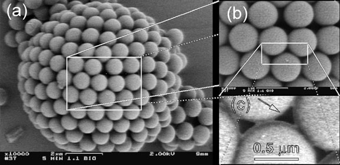
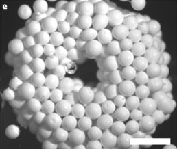
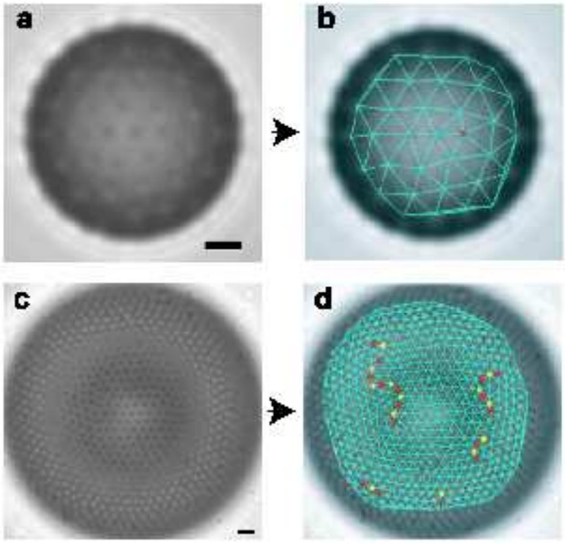
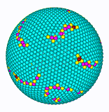

# SpherePacking (CP-2 Winter Semester 2016)
MC Simulator and Renderer for dense packing of spheres on curved manifolds embedded in 3D Space

## Scope
This project is a simulator of colloids. In particular densely packed particles around larger topologies, e.g. dust on the surface of a bubble of gas in a liquid (figs from [1], [2]):

Dense packing on manifolds like spheres are not trivial, since its euler characteristic forbids a regular lattice. Defects must appear. In nature - given a large enough amount of particles - areas with regular lattices are observed. There are grain boundaries between those areas (fig. from [3]):

Which is reproduced in simulation:

Other results are that platonic solids are very densely packed, and that the packing density only very slowly approaches the dense case. Even thousands of particles yield 5% lower packing densities than ideal. See also the [slides](slides.pdf) (with broken videos, sorry!):

[1] Parthibarajan, R., Christoph Reichel, N. L. Gowrishankar and D. Pranitha. “COLLOIDOSOMES DRUG DELIVERY: A REVIEW.” (2011).

[2] Majumder, M., Chopra, N., Andrews, R. et al. Enhanced flow in carbon nanotubes. Nature 438, 44 (2005). 

[3] Travesset A. Universality in the screening cloud of dislocations surrounding a disclination Physical Review B - Condensed Matter and Materials Physics. 68: 1154211-11542115. DOI: 10.1103/Physrevb.68.115421 